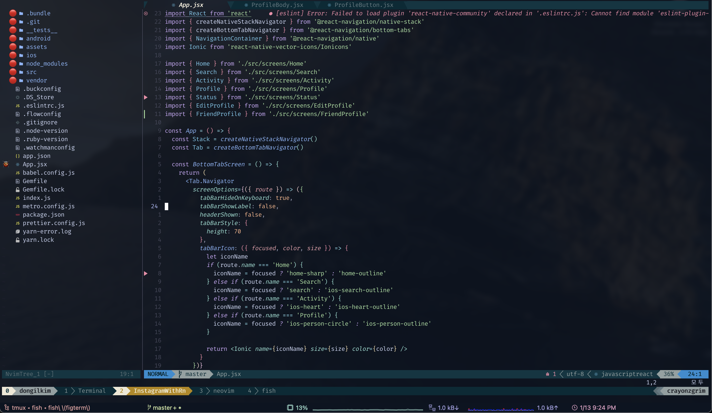

# crayonzgrim's dotfiles

Check my Lazyvim, tmux and other dotfiles.
 
Enjoy it!😁
 
 

## Contents

- Neovim(Lazyvim) config
- tmux config
- git config (with git-delta)

## Required for Lazyvim

- Neovim >= **0.9.0** (needs to be built with **LuaJIT**)
- Git >= **2.19.0** (for partial clones support)
- [LazyVim](https://www.lazyvim.org/)
- a [Nerd Font](https://www.nerdfonts.com/)(v3.0 or greater) **_(optional, but needed to display some icons)_**
- [lazygit](https://github.com/jesseduffield/lazygit) **_(optional)_**
- a **C** compiler for `nvim-treesitter`. See [here](https://github.com/nvim-treesitter/nvim-treesitter#requirements)
- for [telescope.nvim](https://github.com/nvim-telescope/telescope.nvim) **_(optional)_**
  - **live grep**: [ripgrep](https://github.com/BurntSushi/ripgrep)
  - **find files**: [fd](https://github.com/sharkdp/fd)
- a terminal that support true color and *undercurl*:
  - [kitty](https://github.com/kovidgoyal/kitty) **_(Linux & Macos)_**
  - [wezterm](https://github.com/wez/wezterm) **_(Linux, Macos & Windows)_**
  - [alacritty](https://github.com/alacritty/alacritty) **_(Linux, Macos & Windows)_**
  - [iterm2](https://iterm2.com/) **_(Macos)_**
- [Solarized Osaka](https://github.com/craftzdog/solarized-osaka.nvim)

## About me

- [Resume](https://lush-viscount-141.notion.site/b01ba12effe4459d9c5702778fb9688f)
- [Blog](https://patrick-f.tistory.com/category)
- [Linkedin](https://www.linkedin.com/in/patrick69/)
